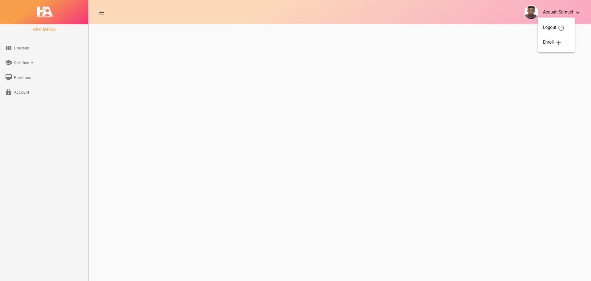
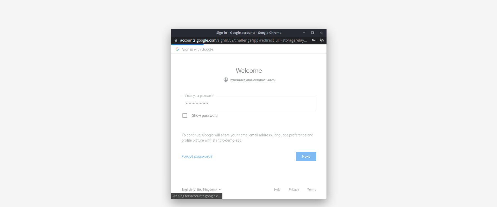

# Project Demo
Assement Project Demonstration

### Structure 
Components | 
------------ | 
Login | 
Dashboard|
Navbar |
Table |


# Approach to problem (2 Approach)

> Coffee. The finest organic suspension ever devised... I beat the Borg with it.
> - Creating your personal api with your modeled data
> - Consuming third party services  

### Creating personal api endpoint 
````
create your sever for the backend 
create the model for the database with the required fields 

[POST Request] 
populate the database by getting data from forms fields (either) req.body with postman or forms inputs
Make a [GET Request]
Request for data the database 
Render the  data in the defined UI component
````

### This is a third-tier heading
````
Subscibe for external api service 
Make a [GET Request] to the provided url 
Render the  data in the defined UI component
````


### Project Images 
<br>




<br>

## Further help
To get more help on the Angular CLI use `ng help` or go check out the [Angular CLI Overview and Command Reference](https://angular.io/cli) page.
